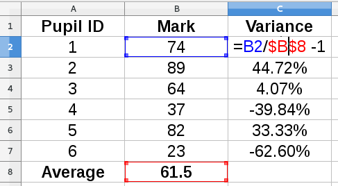
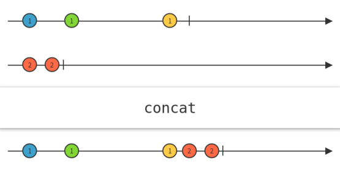
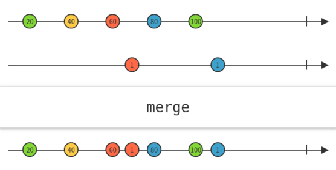
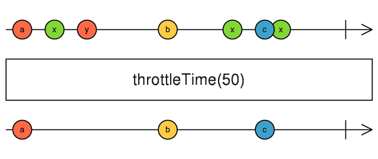
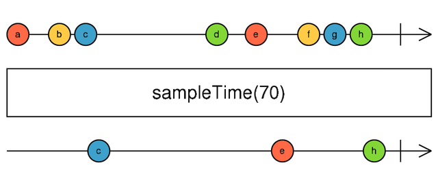
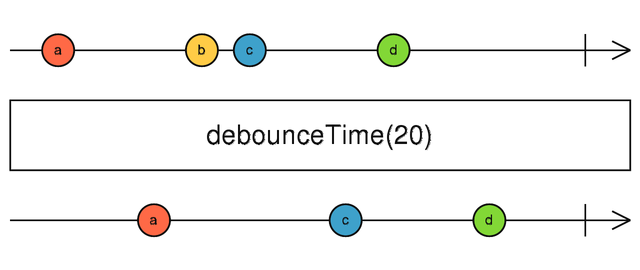
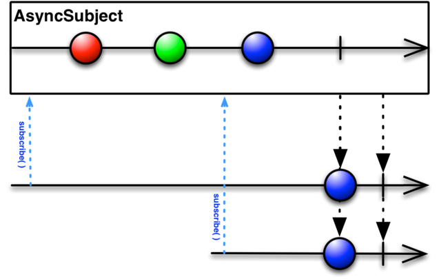
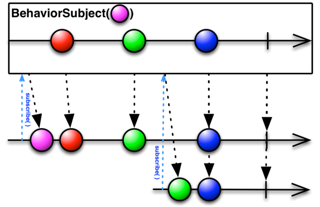
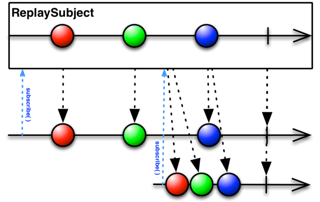

class: center, middle

# Reactive Programming with Bacon.js and RxJS

---

# Agenda

- Intro to Reactive Programming

- Overview of some of the key concepts

- Introduction to two commonly-used frameworks

- Discuss some of the key differences between the frameworks

- Show some code examples


---

# Reactive Programming

- Wikipedia : "An asynchronous programming paradigm concerned with data streams and the propagation of change"

--

- Andre Staltz : “Programming with Async Data Streams”

--

- A different way of thinking about different types of asynchronous data:
  - Mouse clicks
  - Field updates
  - Server-side data
  - Timer 'ticks'
  - Other page events

--

- Designed to be an easier, clearer and more expressive way of handling complex interactions between events


---

# Central Abstractions

- The central abstraction is the 'Observable', or 'Event Stream'
    - Represents a stream of events that can be _observed_ and _reacted_ to
    - Events can be of different types and have different sources
    - Reactive Programming abstracts across these different sources
    - ... so they can be handled in the same way

--

- Observables can be operated on as a whole, rather than as individual events
    - _transforming_ every event in a stream
    - _merging_ two streams
    - _filtering_ events out of a stream
    - _accruing_ state (e.g. counters)

--

- Things can 'subscribe' to streams to be notified and take action on an event
    - The subscriptions contain the side-effects
    - e.g. DOM manipulation
    - This results in clean separation between event flow and side effects


---

# The Original RP System

--

.center[]

---

# What We'll Look at Today

- Introduce Bacon.js and contrast it with traditional approaches for some simple examples

--

- Show some of the common basic operators on single streams
    - Filtering events
    - Transforming events
    - Accumulating state

--

- Move on to talk about our second framework
    - RxJS - an implementation of _Reactive Extensions_ for JavaScript
    - More complex and powerful than Bacon.js

--

- Go through some of the more advanced operators

--

- See how RxJS handles some of the more complex use cases (if there's time)


---

# `EventStream`s in Bacon.js

- Consider our first example
    - Log the x- and y- coordinates of mouse-clicks to the console

--

- Traditionally, we'd add an event listener (<a href="examples/example01a-mouseClick-trad.html" target="_blank">Example 1a</a>):
```javascript
    document.addEventListener("click", console.log);
```

--

- With Bacon.js (<a href="examples/example01b-mouseClick-bacon.html" target="_blank">Example 1b</a>) we use a `EventStream`:
```javascript
    // Create a Bacon.js EventStream
    const eventStream = Bacon.fromEvent(document, "click");

    // Subscribe to the EventStream
    eventStream.onValue(console.log);
```

--

- Notice how the two concerns (raising and handling events) are separated

--

- Also, notice that the `EventStream` is a first-class value


---

# Filtering Event Streams

- As before, but we only want to see the clicks on the right-hand side

--

- Traditionally, we'd use an `if` statement in the callback (<a href="examples/example02a-rhsMouseClick-trad.html" target="_blank">Example 2a</a>)
```javascript
    document.addEventListener("click", e => {
        if (e.clientX > window.innerWidth / 2) {
            console.log(e);
        }
    });
```

--

- We can't use the simple `console.log` function reference because of the `if`

--

- If we needed something else to react to _all_ clicks, we'd need a separate callback

---

# Filtering Event Streams

- With Bacon.js we can apply a `filter` to the original stream (<a href="examples/example02b-rhsMouseClick-bacon.html" target="_blank">Example 2b</a>)

--

    ```javascript
    // Create a Bacon.js EventStream
    const eventStream = Bacon.fromEvent(document, "click");

    // Filter to create a new stream with only the
    // 'right-hand' clicks
    const rhsEventStream = eventStream.filter(
        e => e.clientX > window.innerWidth / 2);

    // Subscribe to the EventStream
    // Note the use of just `log` here
    rhsEventStream.onValue(console.log);
    ```

--

- Notice how we can use `console.log` as before:
    - Because the filtering and side-effect concerns are separated
    - Bacon.js also has a `log()` function

--

- Notice that filtering doesn't affect the original stream...
    - ...so it can be subscribed to independently

---


# Transforming Events

- Let's say we want to show coordinates in the console - e.g. `(123, 456)`

--

- Traditionally, it's in the callback again (<a href="examples/example03a-mouseClickWithCoords-trad.html" target="_blank">Example 3a</a>)
```javascript
    const clickToCoords =
        e => "(" + e.clientX + ", " + e.clientY + ")";

    document.addEventListener("click", e =>
        console.log(clickToCoords(e)));
```

---

# Transforming Events

- With Bacon.js, this is a `map` (<a href="examples/example03b-mouseClickWithCoords-bacon.html" target="_blank">Example 3b</a>)
```javascript
    const clickToCoords =
        e => "(" + e.clientX + ", " + e.clientY + ")";

    // Create a Bacon.js EventStream
    const eventStream = Bacon.fromEvent(document, "click");

    // Convert clicks to coordinates
    const coordStream = eventStream.map(clickToCoords);

    // Subscribe to the EventStream
    coordStream.log();
```

---

# Filtering _and_ Mapping

- So, we've seen how to filter _or_ map events...
    - Now, only show the RHS clicks _and_ show them as coordinates

--

- Starting to get a bit gnarly with the traditional approach (<a href="examples/example04a-rhsMouseClickWithCoords-trad.html" target="_blank">Example 4a</a>)
```javascript
    document.addEventListener("click", e => {
        if (e.clientX > window.innerWidth / 2) {
            console.log(clickToCoords(e));
        }
    });
```

--

- Ultimately, this is because the traditional approach just isn't nicely composable

---

# Filtering _and_ Mapping

- Here's the Bacon.js version (<a href="examples/example04b-rhsMouseClickWithCoords-bacon.html" target="_blank">Example 4b</a>)
```javascript
    const eventStream = Bacon.fromEvent(document, "click");

    const rhsEventStream = eventStream.filter(
            e => e.clientX > window.innerWidth / 2);

    const rhsCoordStream = rhsEventStream.map(clickToCoords);

    rhsCoordStream.log();
```

--

- The various operators chain easily, so we _could_ just do:
```javascript
    Bacon.fromEvent(document, "click")
         .filter(e => e.clientX > window.innerWidth / 2)
         .map(clickToCoords)
         .log();
```

---

# Limiting Events

- Log only the first 5 clicks...
    - ... and make sure you dispose of the listener at the end

--

- Traditionally, we need to maintain some state (<a href="examples/example05a-firstFiveMouseClicks-trad.html" target="_blank">Example 5a</a>)
```javascript
    let clicks = 0;
    document.addEventListener("click", function registerClicks(e) {
        if (clicks < 5) {
            console.log(e);
            clicks += 1;
        } else {
            document.removeEventListener("click", registerClicks);
        }
    });
```

--

- That `let` should be a _massive_ alarm bell...

--

- Also, we need to explicitly deregister the event listener to avoid leaks

--

- I've not tried including filtering and mapping, but you can imagine what it would look like...

---

# Limiting Events

- Bacon.js has `take` , to take values and end the stream (<a href="examples/example05b-firstFiveMouseClicks-bacon.html" target="_blank">Example 5b</a>)
```javascript
    const eventStream = Bacon.fromEvent(document, "click");
    eventStream.take(5).log();
```

--

- This automatically disposes of the memory associated with the stream

--

- Like `filter` and `map`, `take` composes nicely with the other operators
```javascript
    // This is what I didn't dare write in trad-style...
    Bacon.fromEvent(document, "click")
         .filter(e => e.clientX > window.innerWidth / 2)
         .map(clickToCoords)
         .take(5)
         .log();
```

---

# So far...

- Event Streams:
    - Are potentially infinite
    - Can be transformed using operators like `filter` and `map`
    - Are immutable
    - Have operations (like `take`) to avoid the need to manage state

--

- This may start to sound familiar...
    - This is often why this is sometimes referred to as 'Functional Reactive Programming' (FRP)
    - Although, just 'Reactive Programming' is more typical


---

# Accumulating State

- So, we've seen examples of `filter` and `map`, but what about `reduce`?

--

- Let's say we want to adapt our examples to _count_ the number of clicks as well

--

- Bacon.js has the concept of a `Property` as well as an `EventStream`
    - `Property` = `EventStream` + current value

--

- For our example
    - We still have the `EventStream` to log the clicks
    - But we also want a 'click count' `Property`, whose value increments on each click

--

- We can do this using `scan`, the Bacon.js version of `reduce` (<a href="examples/example06-mouseClickAndCount-bacon.html" target="_blank">Example 6</a>)
```javascript
    const clickStream = Bacon.fromEvent(document, "click");
    const clickCount = clickStream.scan(0, (acc, e) => acc + 1);

    clickStream.log();
    clickCount.log();
```

--

- Notice how we are subscribing independently to the two observables

---

# Creating Streams

- `EventStream`s are an abstraction across various types of streams?
    - So, what sort of things can you create an `EventStream` from?

--

- First, some simple cases:
```javascript
    // ... from an array
    const arrayStream = Bacon.fromArray([1, 2, 3, 4, 5]);

    // ... an empty event at fixed intervals (i.e. a timer tick)
    const intervalStream = Bacon.interval(1000)

    // ... sequential values with intervals
    const sequentialStream = Bacon.sequentially(1000,
                                ['a', 'b', 'c', 'd', 'e']);
```

---

# Creating Streams

- Next, we can integrate with other event-related abstractions
```javascript
    // ... from DOM Events (JQuery)
    const clickEventStream = $('#buttonId').asEventStream('click');

    // ... from DOM Events (without JQuery)
    const clickEventStream = Bacon.fromEvent(button, 'click');

    // ... from a Node.js EventEmitter
    const file = fs.createReadStream(filePath);
    const fileStream = Bacon.fromEvent(file, 'data');

    // ... from Promises (e.g. from JQuery AJAX)...
    const agentPromise = $.ajax({
                url: "http://httpbin.org/user-agent" });
    const promiseStream = Bacon.fromPromise(agentPromise);

    // ... or in NodeJS, using axios
    const responsePromise = axios.get(
                        "http://httpbin.org/headers");
    const responseStream = Bacon.fromPromise(responsePromise)
        .map(r => r.data);
```

---

# Creating Streams

- It's also possible to create an `EventStream` from an arbitrary source, using `fromBinder()`
```javascript
    const stream = Bacon.fromBinder(function(sink) {
        sink("first value");
        sink("second value");
        sink("third value");
        sink(new Bacon.End())
        return function() {
            // unsubscribe function if needed
        })

    stream.log();
```

--

- RxJS has all of these, and more, e.g.
    - `interval` - emits an incrementing integer at intervals
    - Better 'no-op' cases for testing and composition - e.g. `never`
    - `from` is more flexible and can create Observables from any iterable
    - Or from [generators](https://github.com/Reactive-Extensions/RxJS/blob/master/doc/mapping/bacon.js/whyrx.md#generators)

--

---

# Switching to RxJS

- RxJS is the JavaScript implementation of <a href="http://reactivex.io" target="_blank">Reactive Extensions</a> 

--

- In contrast to Bacon.js, Reactive Extensions is an API

--

- Multiple implementations exist:
    - Rx.NET (its origins)
    - RxJava
    - RxJS
    - RxScala
    - RxClojure
    - RxSwift
    - ... <a href="http://reactivex.io/languages.html" target="_blank">and others</a>

--

- RxJS is distributed as modules
    - Unlike Bacon.js, where it's everything or nothing
    - `rx.all.js` for the whole lot
    - ... all the way down to `rx.lite.js` for a lightweight version

--

- RxJS also has other modules that add further bindings:
    - <a href="https://github.com/Reactive-Extensions/RxJS-DOM" target="_blank">RxJS-DOM</a> - DOM Bindings, JSONP, WebSockets, WebWorkers
    - <a href="https://github.com/Reactive-Extensions/rx.angular.js" target="_blank">rx.angular.js</a>

---

# API Differences

- In RxJS, everything is an `Observable`
    - No distinction between `EventStream` and `Property`
    - This is one of the main differences between Bacon.js and RxJS

--

- Bacon.js uses the term 'subscriber' to refer to the object listening to incoming data
    - RxJS uses `Observer`

--

- A lot of the core APIs are similar - e.g. `map`, `filter`, `scan`
    - Some minor differences (e.g. argument order)

---

# API Differences

- Here's 'log and count mouse clicks on the right' in Bacon (<a href="examples/example07a-rhsMouseClickAndCount-bacon.html" target="_blank">Example 7a</a>)
```javascript
    const rhsStream = Bacon.fromEvent(document, "click")
            .filter(e => e.clientX > window.innerWidth / 2)
            .map(clickToCoords);
    const rhsCountStream = rhsStream.scan(
            0, (acc, e) => acc + 1);
    rhsStream.log();
    rhsCountStream.log();
```

--

- ... and in RxJS (<a href="examples/example07b-rhsMouseClickAndCount-rxjs.html" target="_blank">Example 7b</a>)
```javascript
    const rhsStream = Rx.Observable.fromEvent(document, "click")
               .filter(e => e.clientX > window.innerWidth / 2)
               .map(clickToCoords);
    // `scan` takes the initial value as the second arg
    const rhsCountStream = rhsStream.scan(
        ((total, e) => total + 1), 0);
    // RxJS has no `log` function, so we have to `subscribe`
    rhsStream.subscribe(console.log);
    rhsCountStream.subscribe(console.log);
```

---

# Visualising Observables

--

- 'Marble Diagrams' are often used to visualise Observables and operators

.center[]

--

- Lots of examples and tools at
    - <a href="http://rxmarbles.com" target="_blank">RxJS Marbles</a>
    - <a href="http://rxviz.com" target="_blank">Rx Visualizer</a>
    - <a href="https://rxfiddle.net" target="_blank">RxFiddle</a>

---

# Combining Observables

- So far, we've looked at operations just on a single Observable
    - However, we can combine / compose Observables in various ways

--

- This is where marble diagrams really come into their own

--

- Simplest example is concatenating or merging two `Observables`

--

- `concat()` - appends events from second `Observable` onto end of first:

.center[]

---

# Combining Observables

- `merge()` - interleaves items from the various sources:

.center[]

.center[(Bacon.js has the same methods for `EventStream`s)]

---

# Combining Observables

- Use case: triggering an action based on pressing enter or clicking a button
```javascript
    const searchClick = Rx.Observable.fromEvent(button, "click");
    const enterKeyUp = Rx.Observable.fromEvent(input, "keyup")
                                    .filter(e => e.keyCode === 13);

    const searchClickOrEnterKeyUp = searchClick.merge(enterKeyUp);
    searchClickOrEnterKeyUp.subscribe(doStuff);
```

--

- We can also combine events from two `Observable`s using a function

--

- This behaviour differs slightly between Bacon.js and RxJS

---

# Combining Observables

- Example: Add up a stream of units and a stream of 10's

--

- In Bacon.js, we use `combineWith` (<a href="examples/example08a-combineWith-bacon.js" target="_blank">Example 8a</a>)
```javascript
    // emits an increasing integer every second
    const unitsStream = Bacon.repeat(i => Bacon.later(1000, i));
    const tensStream = unitsStream.map(x => x * 10);

    const sumStream = Bacon.combineWith(
            unitsStream, tensStream, (u, t) => u + t);
    sumStream.log();

    > 0
    > 11
    > 22
    > 33
    > 44
```

---

# Combining Observables

- The same version in RxJS, using `combineLatest` (<a href="examples/example08b-combineLatest-rxjs.js" target="_blank">Example 8b</a>)
```javascript
    const unitsStream = Rx.Observable.interval(1000);
    const tensStream = unitsStream.map(x => x * 10);

    const sumStream = unitsStream.combineLatest(
                tensStream, (u, t) => u + t);
    sumStream.subscribe(console.log);

    > 0
    > 1    <- glitch
    > 11
    > 12   <- glitch
    > 22
    > 23   <- glitch
    > 33
    > 34   <- glitch
    > 44
```

--

- Bacon.js is giving us 'atomic' updates, whereas we're getting glitches in RxJS

---

# Combining Observables

- With RxJS, we can get around this, by using `zip` (<a href="examples/example08c-zip-rxjs.js" target="_blank">Example 8c</a>)
```javascript
    const unitsStream = Rx.Observable.interval(1000);
    const tensStream = unitsStream.map(x => x * 10);

    const sumStream = unitsStream.zip(
                tensStream, (u, t) => u + t);
    sumStream.subscribe(console.log);

    > 0
    > 11
    > 22
    > 33
    > 44
```

---

# Combining Observables

- A final example showing composition of Observables
    - Iterate through an array emitting values at an interval
    - Bacon.js has `Bacon.sequentially(interval, values)`
    - In RxJS, we can combine streams to achieve the same

--

- For example (<a href="examples/example09-iterateWithInterval-rxjs.js" target="_blank">Example 9</a>)

    ```javascript
    const values = Rx.Observable.from(
                ["red", "green", "blue", "purple", "pink"]);
    const ticks = Rx.Observable.interval(1000);

    const valuesAtInterval = values.zip(ticks, (c, i) => c);

    valuesAtInterval.subscribe(console.log);

    ... all separated by 1 second
    > red
    > green
    > blue
    > purple
    > pink
    ```

---

# Error Handling

- Previously, we've just seen simple subscriptions that just handle successes
    - In the case of errors, RxJS and Bacon.js differ in their default behaviours

--

-  In RxJS, we can provide multiple handlers when we `subscribe` (<a href="examples/example10a-errorHandling-rxjs.js" target="_blank">Example 10a</a>)
```javascript
    const observable = Rx.Observable
       .from([1, 2, 3])
       .concat(Rx.Observable.throw(new Error("An error occurred")))
       .concat(Rx.Observable.from([4, 5]));

    observable.subscribe(
        i   => console.log("Received:", i),
        err => console.log("Error thrown:", err.message),
        ()  => console.log("Completed"));

    > Received: 1
    > Received: 2
    > Received: 3
    > Error thrown: An error occurred
```

--

- Note how the error terminates the stream - the completion handler doesn't fire

---

# Error Handling

- In contrast, in Bacon.js (<a href="examples/example10b-errorHandling-bacon.js" target="_blank">Example 10b</a>)
```javascript
    const eventStream = Bacon.fromArray([1, 2, 3])
        .concat(Bacon.once(new Bacon.Error("An error occurred")))
        .concat(Bacon.fromArray([4, 5]));

    eventStream.log();

    > 1
    > 2
    > 3
    > <error> An error occurred
    > 4
    > 5
    > <end>
```

--

- Note that the error *doesn't* terminate the stream, and we go on to receive the later values _and_ the completion

---

# Error Handling

- We can (almost) get the original RxJS-style behaviour back using `endOnError()` (<a href="examples/example10c-errorHandling-endOnError-bacon.js" target="_blank">Example 10c</a>)
```javascript
    const eventStream = Bacon.fromArray([1, 2, 3])
        .concat(Bacon.once(new Bacon.Error("An error occurred")))
        .concat(Bacon.fromArray([4, 5]));

    eventStream.endOnError().log();

    > 1
    > 2
    > 3
    > <error> An error occurred
    > <end>
```

--

- Notice that we *still* get the completion event in this case

---

# Backpressure

- What happens if our `Observable` emits events faster than our `Observer` can process them?
    - Handling mouse move events
    - Autocomplete - we don't want to make a request on every `keyup` event
    - Rendering tweets arriving on a hashtag to make them human-readable

--

- Two main strategies for handling this 'backpressure'
    - _Lossy_ - discarding events
    - _Lossless_ - queue / buffer events or batch processing

--

- Bacon.js and RxJS have similar methods for dealing with these cases
    - Some of the following operators have [changed in RxJS 5](https://github.com/ReactiveX/rxjs/blob/master/MIGRATION.md#operators-renamed-or-removed)

---

# Backpressure

- `throttle(interval)`
    - Emits the first item from the source
    - Then ignores subsequent items until `interval` ms have passed
    - Then starts again
    - e.g. rate-limiting execution of handlers on events like resize / scroll

.center[]

---

# Backpressure

- `sample(interval)`
    - Every `interval` ms it samples the source
    - And emits the latest item emitted by the source
    - e.g. sampling values from a stock ticker every 5 seconds

.center[]

---

# Backpressure

- `debounce(interval)`:
    - Emits an item from the source `Observable` if no intervening item has been emitted after `interval` ms
    - Basically, if the source has been 'quiet' for `interval` ms
    - e.g. waiting for 0.5s after a user has finished typing

.center[]

- All of these are easier to see with an example (<a href="examples/example11a-backpressure-lossy-rxjs.html" target="_blank">Example 11a</a>)

---

# Backpressure

- Now for some lossless strategies

- `buffer*` methods buffer data in memory then emit an array
    - `bufferWithCount(count)` emits when the buffer reaches `count` items
    - `bufferWithTime(time)` emits every `time` ms (possibly empty)
    - `bufferWithTimeOrCount(time, count)` combines them

- Memory usage is dependent on buffer 'size'

- Again, it's easier to see with an example (<a href="examples/example11b-backpressure-lossless-rxjs.html" target="_blank">Example 11b)</a>

---

# AutoComplete with RxJS

- One of the canonical examples of reactive programming is 'AutoComplete'
    - User enters search term
    - If longer than two characters, search Wikipedia and present results
    - 'Wait' for user to stop typing for a bit before querying
    - If no results, notify the user
    - If an error occurs, notify the user

--

- Pulls together a number of techniques we've seen so far
    - Creating `Observable`s from DOM events
    - Filtering (>2 characters)
    - Backpressure - waiting for `keyup` events to settle down before querying
    - Handling responses
    - Error handling - retrying and notification

--

- See <a href="examples/example12-autocomplete-rxjs.html" target="_blank">example 12</a>

---

class: center, middle

# Advanced Topics

.center[(or just [skip to the end](#comparison-table))]

---

# Hot vs Cold Observables

- In Bacon.js, observable only emits a value when a subscriber subscribes to it
```javascript
    const stream = Bacon.interval(1000);
    console.log("Stream created");
    setTimeout(() => stream.log(), 5000);

    > Stream created
    ... no events are emitted yet
    ... as there are no subscribers
    ... 5 seconds later ...
    > {}
    > {}
    > {}
    > {}
```

---

# Hot vs Cold Observables

- Also, _all_ subscribers to the same observable _always_ get the same event (<a href="examples/example13a-hotVsCold-bacon.js" target="_blank">Example 13a</a>)
```javascript
    // A clunkier version of Rx.Observable.interval(1000)
    const stream = Bacon.repeat(i => Bacon.later(1000, i));
    console.log("Stream created");
    stream.onValue(e => console.log("Subscriber 1: " + e));

    setTimeout(() =>
        stream.onValue(e => console.log("Subscriber 2: " + e))
        , 5000);

    > Stream created
    > Subscriber 1: 0
    > Subscriber 1: 1
    > Subscriber 1: 2
    > Subscriber 1: 3
    > Subscriber 1: 4
    > Subscriber 2: 4
    > Subscriber 1: 5
    > Subscriber 2: 5
    ...
```

---

# Hot vs Cold Observables

- In RxJS it's a bit more complicated (<a href="examples/example13b-hotVsCold-rxjs.js" target="_blank">Example 13b</a>)
```javascript
    const stream = Rx.Observable.interval(1000);
    console.log("Stream created");
    stream.subscribe(e => console.log("Subscriber 1: " + e));

    setTimeout(() =>
        stream.subscribe(e => console.log("Subscriber 2: " + e))
        , 5000);

    > Stream created
    > Subscriber 1: 0
    > Subscriber 1: 1
    > Subscriber 1: 2
    > Subscriber 1: 3
    > Subscriber 1: 4
    > Subscriber 2: 0
    > Subscriber 1: 5
    > Subscriber 2: 1
    > Subscriber 1: 6
    > Subscriber 2: 2
```

---

# Hot vs Cold Observables

- `Rx.Observable.interval` is what's called a _cold observable_ in RxJS
    - Emits values only when Observers subscribe to it (like Bacon.js)
    - Every new subscriber receives events from the start (*un*like Bacon.js)

--

- In contrast, a _hot observable_:
    - May start emitting values before it has any `Observer`s
    - `Observer`s that join later get the latest values...
    - ... and they all get the same value
    - Just like traditional JavaScript events

--

- This is another one of the key differences between Bacon.js and RxJS:
    - Bacon.js has no _cold observables_
    - So `EventStream`s are always consistent among subscribers
    - RxJS has more options, therefore more flexible ...
    - ... but we need to be careful to avoid unexpected behaviour
    - Need to pay attention to what kind of `Observable` we're using

---

# Subjects (RxJS only)

- RxJS also has a `Subject` abstraction
    - A `Subject` can act as both an `Observer` and `Observable`
    - Can subscribe to an `Observable` (an `Observer`)
    - Can produce values (an `Observable`)
    - Can have its own subscribers (an `Observable`)
    - Acts like a 'bridge' or 'proxy' between a data source and subscribers
    - Can act as a 'decorator'

--

- Simple example - a plain old `Subject` (<a href="examples/example14a-subject-rxjs.js" target="_blank">Example 14a</a>)
```javascript
    const source = Rx.Observable.interval(1000);
    const subject = new Rx.Subject();
    source.subscribe(subject);
    subject.subscribe(console.log);

    > 0
    > 1
    > 2
    > 3
    > 4
    ...
```

---

# Subjects (RxJS only)

- By introducing the proxy, we can add more complex behaviour
    - Particularly in cases with multiple subscribers

--

- Recall what happens with two subscribers, because `interval` is a _cold observable_, that restarts for each subscriber (<a href="examples/example14b-source-withTwoSubscribers-rxjs.js" target="_blank">Example 14b</a>)
```javascript
    const source = Rx.Observable.interval(1000);
    source.subscribe(e => console.log("Subscriber 1: " + e));
    setTimeout(() => {
        source.subscribe(e => console.log("Subscriber 2: " + e))
    }, 3000);

    > Subscriber 1: 0
    > Subscriber 1: 1
    > Subscriber 1: 2
    > Subscriber 2: 0
    > Subscriber 1: 3
    > Subscriber 2: 1
    > Subscriber 1: 4
    > Subscriber 2: 2
    > Subscriber 1: 5
```

---

# Subjects (RxJS only)

- If we introduce a basic `Subject`, it turns `interval` into a _hot observable_ (<a href="examples/example14c-subject-withTwoSubscribers-rxjs.js" target="_blank">Example 14c</a>)
```javascript
    const source = Rx.Observable.interval(1000);
    const subject = new Rx.Subject();
    source.subscribe(subject);

    subject.subscribe(e => console.log("Subscriber 1: " + e));
    setTimeout(() => {
        subject.subscribe(e => console.log("Subscriber 2: " + e))
    }, 3000);

    > Subscriber 1: 0
    > Subscriber 1: 1
    > Subscriber 1: 2
    > Subscriber 2: 2
    > Subscriber 1: 3
    > Subscriber 2: 3
    > Subscriber 1: 4
    > Subscriber 2: 4
    ...
```

---

# Subjects (RxJS only)

- `AsyncSubject` emits the last value of a sequence when it terminates
    - It then caches the value forever
    - Subsequent subscribers receive the value immediately

--

.center[]

---

# Subjects (RxJS only)

- Example (<a href="examples/example14d-asyncSubject-rxjs.js" target="_blank">Example 14d</a>)

    ```javascript
    // Emits "red", "green", "blue" at 1s intervals
    const source = Rx.Observable.from(["red", "green", "blue"])
        .zip(Rx.Observable.interval(1000), (c, i) => c);

    const subject = new Rx.AsyncSubject();
    source.subscribe(subject);

    subject.subscribe(e => console.log("Subscriber 1: " + e));
    setTimeout(() => {
        subject.subscribe(e => console.log("Subscriber 2: " + e))
    }, 5000);

    > ... at T+3, first subscriber emits last value
    > Subscriber 1: blue

    > ... at T+5, second subscriber gets last value
    Subscriber 2: blue
    ```

- Useful for async network requests that we want to cache


---

# Subjects (RxJS only)

- `BehaviorSubject`
    - When `Observer` subscribes, receives the latest emitted value
    - Then receives all subsequent values emitted
    - Requires an initial value in the constructor

--

.center[]


---

# Subjects (RxJS only)

- Example (<a href="examples/example14e-behaviorSubject-rxjs.js" target="_blank">Example 14e</a>)

    ```javascript
    const subject = new Rx.BehaviorSubject("purple");
    source.subscribe(subject);

    subject.subscribe(e => console.log("Subscriber 1: " + e));
    setTimeout(() => {
        subject.subscribe(e => console.log("Subscriber 2: " + e))
    }, 2500);

    > ... initial value
    > Subscriber 1: purple
    > Subscriber 1: red
    > Subscriber 1: green
    > ... at T+2.5s, subscriber 2 joins the party
    > Subscriber 2: green
    > Subscriber 1: blue
    > Subscriber 2: blue
    ```

---

# Subjects (RxJS only)

- `ReplaySubject`
     - When `Observer` subscribes, receives all values emitted so far
     - Then receives all subsequent values emitted
     - Can customise with count- or time-based windows

--

.center[]

---

# Subjects (RxJS only)

- Example (<a href="examples/example14f-replaySubject-rxjs.js" target="_blank">Example 14f</a>)

    ```javascript
    const subject = new Rx.ReplaySubject();
    source.subscribe(subject);

    subject.subscribe(e => console.log("Subscriber 1: " + e));
    setTimeout(() => {
        subject.subscribe(e => console.log("Subscriber 2: " + e))
    }, 2500);

    > Subscriber 1: red
    > Subscriber 1: green
    > ... when subscriber 2 joins, it immediately gets
    > ... 'red' and 'green'
    > Subscriber 2: red
    > Subscriber 2: green
    > Subscriber 1: blue
    > Subscriber 2: blue
    ```

--

- So, in RxJS, we have many more options about how we can customise Observable behaviours

---

# Schedulers (RxJS only)

- `Scheduler`s are part of Rx that allows finer-tuned control over the threading model for notifying `Observer`s
    - As such, it's more designed for use in multi-threaded environments
    - Basically, not used much in Javascript and guidance is to be careful!
    - Bacon.js doesn't support this
    - However, it can be useful in testing (watch this space...)

--

- Each operator in RxJS uses a default `Scheduler` internally
    - Selected to provide best performance in most likely case
    - We can override this using `observeOn(newScheduler)`
    - After this, every call to `onNext` happens in the context defined by `newScheduler`

---

# Schedulers (RxJS only)

- The `immediate` scheduler notifies synchronously, blocking the thread (<a href="examples/example15a-schedulers-immediate-rxjs.js" target="_blank">Example 15a</a>)
```javascript
    console.log("Before subscription");

    Rx.Observable.range(1, 3)
        .do(i => console.log("Processing value", i))
        .observeOn(Rx.Scheduler.immediate)
        .subscribe(i => console.log("Emitted", i));

    console.log("After subscription");

    > Before subscription
    > Processing value 1
    > Emitted 1
    > Processing value 2
    > Emitted 2
    > Processing value 3
    > Emitted 3
    > After subscription
```

--

- Well-suited for predictable and inexpensive (e.g. `O(1)`) operations

---

# Schedulers (RxJS only)

- The `default` scheduler (a.k.a. `async`) schedules work asynchronously (<a href="examples/example15b-schedulers-default-rxjs.js" target="_blank">Example 15b</a>)
```javascript
    console.log("Before subscription");

    Rx.Observable.range(1, 3)
        .do(i => console.log("Processing value", i))
        .observeOn(Rx.Scheduler.default)
        .subscribe(i => console.log("Emitted", i));

    console.log("After subscription");

    > Before subscription
    > Processing value 1
    > Processing value 2
    > Processing value 3
    > After subscription
    > Emitted 1
    > Emitted 2
    > Emitted 3
```

--

- Never blocks the event loop, so useful for operations that take longer

---

# Schedulers (RxJS only)

- Testing asynchronous behaviour is hard
    - Unpredictable race conditions
    - Accurately testing time-based functions _in real time_ is slow
    - e.g. test that error is called after waiting 10s for a response

--

- Another `Scheduler` implementation in RxJS is the `TestScheduler`
    - Allows us to emulate time and create deterministic tests

--

- A specialization of a `VirtualTimeScheduler`
    - Executes actions in _virtual_ time instead of in real time
    - Scheduled actions are placed in a queue
    - Actions are assigned a moment in _virtual time_
    - The scheduler then runs the actions in order when its clock advances

---

# Schedulers (RxJS only)

- Example `TestScheduler` (<a href="examples/example15c-schedulers-testSchedulers-rxjs.js" target="_blank">Example 15c</a>)

    ```javascript
    const scheduler = new Rx.TestScheduler();
    const testObject = Rx.Observable.interval(1000, scheduler);
    testObject.subscribe(console.log);

    advanceTime(1000);
    advanceTime(500);
    advanceTime(500);
    advanceTime(999);
    advanceTime(1);

    function advanceTime(ms) {
        console.log("Advancing time by", ms, "ms");
        scheduler.advanceBy(ms);  }

    > Advancing time by 1000 ms
    > 0
    > Advancing time by 500 ms
    > Advancing time by 500 ms
    > 1
    > Advancing time by 999 ms
    > Advancing time by 1 ms
    > 2
    ```

---

class: center, middle

# Appendices

---
name: comparison-table
# Comparison Table

|                                       | Bacon.js | RxJS      |
| ------------------------------------- |:--------:|:---------:|
| Properties                            | Yes      | No        |
| Range of creation operators?          | Smaller  | Larger    |
| Many language implementations?        | No       | Yes       |
| Modular distribution?                 | No       | Yes       |
| Atomic updates?                       | Always   | Opt-in    |
| Error terminates Observable?          | No       | Yes       |
| Hot observables                       | Yes      | Yes       |
| Cold observables                      | No       | Yes       |
| Subjects for decorating streams?      | No       | Yes       |
| Schedulers?                           | No       | Yes       |
| JQuery Support?                       | Yes      | Yes       |
| Angular Support?                      | Possible | Yes       |
| Performance                           | Lower    | Optimised |
| Compatible with ES7 Observables spec? | No       | RxJS 5    |

---

# Links & Resources

* [Bacon.js](https://baconjs.github.io)
* [ReactiveX](http://reactivex.io)
* [Andre Staltz - 'The introduction to Reactive Programming you've been missing'](https://gist.github.com/staltz/868e7e9bc2a7b8c1f754)
* [Andre Staltz - 'Introduction to Reactive Programming' Course](https://egghead.io/courses/introduction-to-reactive-programming)
* [BaconJS for RxJS Users](https://baconjs.github.io/api.html#for-rxjs-users)
* [RxJS for Bacon.js Users](https://github.com/Reactive-Extensions/RxJS/blob/master/doc/mapping/bacon.js/whyrx.md)
* [RxJS Marbles](http://rxmarbles.com)
* [Rx Visualizer](https://rxviz.com)
* [This presentation (and examples)](https://github.com/martinrist/reactive-with-rxjs-bacon)