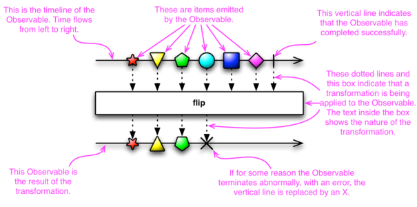

class: center, middle

# Reactive Programming with Bacon.js and RxJS


---

# Agenda

1. Introduction
2. Deep-dive
3. ...

---

# What is Reactive Programming?

- Wikipedia : "An asynchronous programming paradigm concerned with data streams and the propagation of change"

- A different way of thinking about asynchronous data, e.g.:
    - Mouse clicks
    - Field updates
    - Server-side data
    - Timer 'ticks'
    - Other page events 

- Designed to be an easier, clearer and more expressive way of handling complex interactions between events

- Another approach to avoiding 'callback hell'

- The central abstraction is the 'observable':
    - Represents a stream of events that can be observed and reacted to
    - Events can be of different types and have different sources
    - Reactive Programming abstracts across these different sources so they can be handled in the same way

- Observables can be operated on 'as a whole', rather than individual events, e.g.:
    - merging two streams
    - filtering events out of a stream
    - accruing state (e.g. counters)

- Things can 'subscribe' to streams to be notified and take action
    - Separates event flow and side effects

- Can think of this in terms of dependent things _reacting_ to changes in their dependencies:
    - Rather than the data sources _pushing_ data into their dependents

---

# The Original Reactive System

- The spreadsheet

- Cells declare their dependencies on other cells and react to changes automatically


---

# History

- Much early work done by Erik Meijer whilst at MSFT

- 2012 ACM Paper - 'Your Mouse is a Database'

- 2009 - Reactive Extensions for .NET released
    - Subsequently extended to other languages

- TODO: Add a bit here about Bacon and RxJS

---

# What We'll Look at Today

- Introduce bacon.js and contrast it with trad approaches for simple examples

- Show some of the common operators on streams

- Talk a bit about RxJS
    - Implementation of Reactive Extensions for JavaScript

- Discuss some of the differences between the two

---

# Creating and Subscribing to Event Streams

- Log the x- and y- coordinates of mouse-clicks to the console

- Traditionally, add an event listener (<a href="examples/example1-mouseClick-trad.html" target="_blank">Example</a>):
```javascript
    document.addEventListener("click", console.log);
```

- With Bacon (<a href="examples/example1-mouseClick-bacon.html" target="_blank">Example</a>) we use a `EventStream`:
```javascript
    // Create a Bacon EventStream
    const eventStream = Bacon.fromEvent(document, "click");

    // Subscribe to the EventStream
    eventStream.onValue(console.log);
```

- Notice how the two concerns (raising and handling events) are separated

- Also, notice that the event stream is a first-class value


---

# Filtering Event Streams

- As before, but we only want to see the clicks on the right-hand side

- Traditionally, we'd use an `if` statement in the callback:
```javascript
    document.addEventListener("click", e => {
        if (e.clientX > window.innerWidth / 2) {
            console.log(e);
        }
    });
```

- Note that we can no longer use the simple `console.log` reference because of the conditional

- If we needed something else to react to _all_ clicks, we'd need a separate callback

- With Bacon.js we can apply a `filter` to the original stream:
```javascript
    // Create a Bacon EventStream
    const eventStream = Bacon.fromEvent(document, "click");

    // Filter to create a new stream with only the 'right-hand' clicks
    const rhsEventStream = eventStream.filter(
        e => e.clientX > window.innerWidth / 2);

    // Subscribe to the EventStream
    // Note the use of just `log` here
    rhsEventStream.log();
```

- Notice that we can still use `log` because we've separated the filtering from the side-effect

- Notice that filtering doesn't affect the original stream...
    - ...so it can be subscribed to independently

---


# Transforming values in a Stream

- Let's say we want to represent the coordinates in the console - e.g. `(123, 456)`

- Traditionally, it's in the callback again:
```javascript
    const clickToCoords =
        e => "(" + e.clientX + ", " + e.clientY + ")";

    document.addEventListener("click", e =>
        console.log(clickToCoords(e)));
```

- With Bacon, this is just a `map`:
```javascript
    const clickToCoords =
        e => "(" + e.clientX + ", " + e.clientY + ")";

    // Create a Bacon EventStream
    const eventStream = Bacon.fromEvent(document, "click");

    // Convert clicks to coordinates
    const coordStream = eventStream.map(clickToCoords);

    // Subscribe to the EventStream
    coordStream.log();
```

---

# Combining Filtering and Mapping

- Only show the RHS clicks _and_ show them as coordinates.

- Starting to get a bit gnarly with the traditional approach, because it's just not nicely composable:
```javascript
    document.addEventListener("click", e => {
        if (e.clientX > window.innerWidth / 2) {
            console.log(clickToCoords(e));
        }
    });
```

- Here's the Bacon version:
```javascript
    const eventStream = Bacon.fromEvent(document, "click");
    const rhsEventStream = eventStream.filter(
            e => e.clientX > window.innerWidth / 2);
    const rhsCoordStream = rhsEventStream.map(clickToCoords);
    rhsCoordStream.log();
```

- The various operators chain easily, so we _could_ just do:
```javascript
    Bacon.fromEvent(document, "click")
         .filter(e => e.clientX > window.innerWidth / 2)
         .map(clickToCoords)
         .log();
```

---

# Taking a certain number of events from a stream

- Log only the first 5 clicks...
    - ... and make sure you dispose of the listener at the end

- Traditionally, we need to maintain some state:
```javascript
    let clicks = 0;
    document.addEventListener("click", function registerClicks(e) {
        if (clicks < 5) {
            console.log(e);
            clicks += 1;
        } else {
            document.removeEventListener("click", registerClicks);
        }
    });
```

- That `let` should be a _massive_ alarm bell...

- Also, we need to explicitly deregister the event listener to avoid leaks

- Bacon.js has the `take` operator, to take values then end the stream:
```javascript
    const eventStream = Bacon.fromEvent(document, "click");
    eventStream.take(5).log();
```

- Again, this composes nicely with the other operators, unlike the traditional approach

---

# Where are we?

- Streams:
    - Are potentially infinite
    - Can be transformed using operators like `filter`, `map` etc
    - Are immutable
    - Have operations to avoid the need to manage state

- Sound familiar?

- This is often why this stuff is referred to as 'Functional Reactive Programming' (FRP)

- ... although that's technically different, and *definitely* a story for another time

- So, we've seen examples of `filter` and `map`, but what about `reduce`?

---

# Bacon Properties

- Earlier, we saw examples of bacon.js's `EventStream` - a type of observable

- The other flavour of observable in bacon.js is the `Property`:
    - Basically, an `EventStream` with the concept of 'current value'

- Let's say we want to adapt the earlier examples to _count_ the number of clicks as well
    - Still have the `EventStream` for the clicks
    - But we also want a 'click count' `Property`, whose value increments on each click

- We can do this using `scan`, Bacon's version of `reduce`:
```javascript
    const clickStream = Bacon.fromEvent(document, "click");
    const clickCount = clickStream.scan(0, (acc, e) => acc + 1);

    clickStream.log();
    clickCount.log();
```

- Notice how we are subscribing independently to the two observables

- Also notice that there's no state being maintained in our code

---

# Creating Streams from...

- Remember the bit about Streams being a unifying abstraction across various things?

- What sort of things can you create an EventStream from?

- Simple cases:

```javascript
    // ... from an array
    const arrayStream = Bacon.fromArray([1, 2, 3, 4, 5]);

    // ... an empty event at fixed intervals (i.e. a timer tick)
    const intervalStream = Bacon.interval(1000)

    // ... sequential values with intervals
    const sequentialStream = Bacon.sequentially(1000, ['a', 'b', 'c', 'd', 'e']);
```

- Also integration with other JS event-related abstractions

```javascript
    // ... from DOM Events (JQuery)
    const clickEventStream = $('#buttonId').asEventStream('click');

    // ... from DOM Events (without JQuery)
    const clickEventStream = Bacon.fromEvent(button, 'click');

    // ... from a Node.js EventEmitter
    const file = fs.createReadStream(filePath);
    const fileStream = Bacon.fromEvent(file, 'data');
    ```

    // ... from Promises (e.g. from JQuery AJAX)...
    const agentPromise = $.ajax({ url: "http://httpbin.org/user-agent" });
    const promiseStream = Bacon.fromPromise(agentPromise);

    // ... or in NodeJS, using axios
    const responsePromise = axios.get("http://httpbin.org/headers");
    const responseStream = Bacon.fromPromise(responsePromise)
        .map(r => r.data);
```

- It's also possible to create an `EventStream` from an arbitrary source, using the `Bacon.fromBinder` function

- RxJS has all of these, and more, e.g.:
    - `interval` - emits an incrementing integer
    - Better 'no-op' cases for testing and composition - e.g. `never`
    - `from` is more flexible and can create Observables from a more general iterable:
        - as opposed to Bacon's specific `fromXXX` methods
        - e.g. ES6 Set and Map objects
        - Or [generators](https://github.com/Reactive-Extensions/RxJS/blob/master/doc/mapping/bacon.js/whyrx.md#generators)


---

# Over to RxJS

- RxJS is the JavaScript implementation of [Reactive Extensions](http://reactivex.io)

- In contract to bacon.js (a specific implementation), Reactive Extensions is an API

- Multiple implementations exist:
    - Rx.NET (which is where it came from)
    - RxJava
    - RxJS
    - RxScala
    - RxClojure
    - RxSwift
    - ... [and others](http://reactivex.io/languages.html)

- We're just going to look at RxJS here

- Modular distribution (unlike bacon.js)
    - `rx.all.js` for the whole lot
    - ... all the way down to `rx.lite.js` for a lightweight version
    - https://github.com/Reactive-Extensions/RxJS/blob/master/doc/mapping/bacon.js/whyrx.md#generators

- RxJS also has other modules that add further bindings:
    - [RxJS-DOM](https://github.com/Reactive-Extensions/RxJS-DOM) - DOM Bindings, JSONP, WebSockets, WebWorkers
    - [rx.angular.js](https://github.com/Reactive-Extensions/rx.angular.js)

---

# Terminology Changes

- Everything is an `Observable`
    - No distinction between `EventStream` and `Property`
    - This is one of the main differences between bacon.js and RxJS

- Bacon.js uses the term 'subscriber' to refer to the object listening to incoming data
    - RxJS uses `Observer`

- A lot of the core APIs are similar - e.g. `map`, `filter`, `scan`, with some minor differences (e.g. argument order)

- Here's the 'log and count mouse clicks on the right' example in RxJS:

```javascript
    const rhsCoordStream =
           Rx.Observable.fromEvent(document, "click")
               .filter(e => e.clientX > window.innerWidth / 2)
               .map(clickToCoords);

    // `scan` takes the initial value as the second arg
    const rhsCountStream = rhsCoordStream.scan(((total, e) => total + 1), 0);

    // RxJS has no `log` function, so we have to `subscribe`
    rhsCoordStream.subscribe(console.log);
    rhsCountStream.subscribe(console.log);
```

---

# Visualising Observables

- 'Marble Diagrams' are often used to visualise Observables and operators



- Lots of examples at [RxJS Marbles](http://rxmarbles.com):

---

# Hot vs Cold Observables

- In bacon.js, an observable only emits a value when a subscriber subscribes to it:
```javascript
    const stream = Bacon.interval(1000);
    console.log("Stream created");
    setTimeout(() => stream.log(), 5000);

    > Stream created
    ... 5 seconds later ...
    > {}
    > {}
    > {}
```

- Also, all subscribers to the same observable always get the same event:
```javascript
    // A clunkier version of Rx.Observable.interval(1000)
    const stream = Bacon.repeat(i => Bacon.later(1000, i));
    console.log("Stream created");
    stream.onValue(e => console.log("Subscriber 1: " + e));

    setTimeout(() =>
        stream.onValue(e => console.log("Subscriber 2: " + e))
        , 5000);

    > Stream created
    > Subscriber 1: 0
    > Subscriber 1: 1
    > Subscriber 1: 2
    > Subscriber 1: 3
    > Subscriber 1: 4
    > Subscriber 2: 4
    > Subscriber 1: 5
    > Subscriber 2: 5
    > Subscriber 1: 6
    > Subscriber 2: 6
    ...
```

- In RxJS it's a bit more complicated:
```javascript
    const stream = Rx.Observable.interval(1000);
    console.log("Stream created");
    stream.subscribe(e => console.log("Subscriber 1: " + e));

    setTimeout(() =>
        stream.subscribe(e => console.log("Subscriber 2: " + e))
        , 5000);

    > Stream created
    > Subscriber 1: 0
    > Subscriber 1: 1
    > Subscriber 1: 2
    > Subscriber 1: 3
    > Subscriber 1: 4
    > Subscriber 2: 0
    > Subscriber 1: 5
    > Subscriber 2: 1
    > Subscriber 1: 6
    > Subscriber 2: 2
```

- `Rx.Observable.interval` is what's called a _cold observable_ in RxJS:
    - Emits values only when Observers subscribe to it (like bacon.js)
    - Every new subscriber receives events from the start (*not* like bacon.js)

- In contrast, a _hot observable_:
    - May start emitting values before it has any observers
    - Observers joining later may observe values midway through the observable
    - All Observers to the same Hot Observable receive exactly the same value
    - Just like traditional JavaScript events

- It's possible to convert a _cold observable_ to a _hot observable_

- This is another one of the key differences between bacon.js and RxJS:
    - bacon.js has no _cold observables_, so EventStreams and Properties are consistent among subscribers
    - RxJS has more options, therefore more flexible
    - But we need to be careful to avoid unexpected behaviour
    - Need to pay attention to what kind of Observable we're using

- Can cause duplicate network requests:
    - We want to make a call every 5 seconds (`Rx.Observable.interval(5000)`)
    - We get an Observable of the response
    - We have multiple subscribers to the response
    - TODO: Simple example

---

# Subjects (RxJS only)

- TODO: TBC

---

# Disposables (RxJS only)

- TODO: TBC

---

# Schedulers & Testing (RxJS only)

- TODO: From Chapter 5 of 'Reactive Programming with RxJS'

---

# Backpressure

- TODO: [Write up chapter](https://www.safaribooksonline.com/library/view/mastering-reactive-javascript/9781786463388/d9651fd2-fff2-4dee-82de-6bf1eddff71b.xhtml)


---

# Glitches

- Example of tens / units in Bacon
    - Atomic updates

- RxJS
    - Can get intermediate results

- The price is performance
    - See https://github.com/baconjs/bacon.js/wiki/FAQ#isnt-it-slow-how-is-the-performance
    - Add RxJS link to performance comparison

---

# Error Handling

- TODO: Complete section from [book](https://www.safaribooksonline.com/library/view/mastering-reactive-javascript/9781786463388/dcd88f19-083b-4279-88cd-1a678dc61487.xhtml)

* In RxJS:
    - `.subscribe(onNextHandler, errorHandler, completionHandler)`
    - Errors terminate stream

- In bacon.js:
    - the Error event does not terminate a stream.
    - So, a stream may contain multiple errors.
    - To me, this makes more sense than always terminating the stream on error;
    - this way the application developer has more direct control over error handling.
    - You can always use `stream.endOnError()` to get a stream that ends on error!

---

# AutoComplete with RxJS

- Pull stuff together, using
    - Debounce
    - JSON / Ajax
    - DOM updates

- TODO: Complete example

- Based on https://github.com/Reactive-Extensions/RxJS/tree/master/examples/autocomplete

---

# Interop with ES6 Generators

- Interop with Generators and Promises
    - https://github.com/Reactive-Extensions/RxJS/blob/master/doc/mapping/bacon.js/whyrx.md#generators
    - https://github.com/Reactive-Extensions/RxJS/blob/master/doc/mapping/bacon.js/whyrx.md#promises
    - In particular `toPromise`

---

# Comparison Table

- TODO: Add comparison table, with attributes like:
    - Multi-language
    - Modularity
    - Hot observables
    - Cold observables
    - Properties
    - Glitch-free performance
    - Error terminates Observable
    - Performance
    - Generator support?
    - Angular (+ other framework) bindings?
    - Scheduler options (no for Bacon because it's just JS)

---

# Links

* [Why Bacon?](https://github.com/baconjs/bacon.js#why-bacon)
* [BaconJS for RxJS Users](https://baconjs.github.io/api.html#for-rxjs-users)
* [RxJS for Bacon.js Users](https://github.com/Reactive-Extensions/RxJS/blob/master/doc/mapping/bacon.js/whyrx.md)
* ['Reactive JavaScript Programming' video](https://www.safaribooksonline.com/library/view/reactive-javascript-programming/9781787284913/)
* [RxJS 4.0 Book](https://xgrommx.github.io/rx-book)